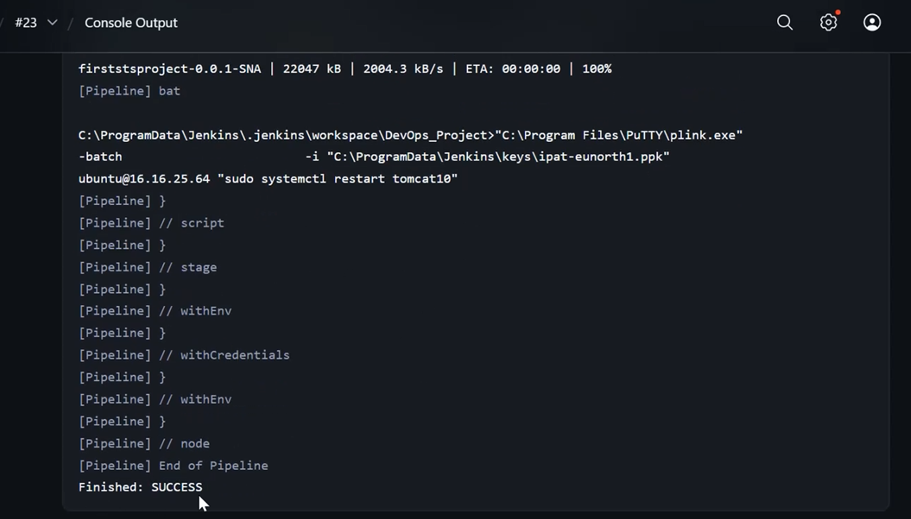
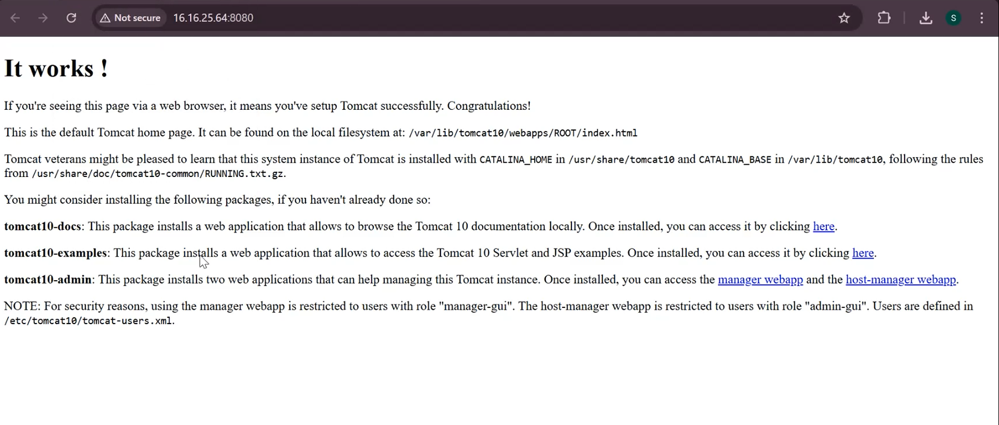

# DevOps Project – Spring Boot CI/CD Deployment using Terraform, Jenkins & Tomcat

## Overview

This project demonstrates the implementation of a complete DevOps CI/CD pipeline for deploying a Spring Boot application using Terraform, Jenkins, Maven, AWS EC2, and Apache Tomcat.

The project automates the process of building, provisioning infrastructure, and deploying the application using Infrastructure as Code (IaC) and Continuous Integration/Continuous Deployment (CI/CD) practices.

---

# Technologies Used

- Java
- Spring Boot
- Maven
- Jenkins
- Terraform
- AWS EC2
- Apache Tomcat 10
- Git & GitHub
- Linux (Ubuntu)

---

# Project Objective

The main objective of this project is to automate the software deployment lifecycle by integrating:

- Source Code Management using GitHub
- Build Automation using Maven
- Infrastructure Provisioning using Terraform
- CI/CD Pipeline using Jenkins
- Application Deployment on Apache Tomcat Server

---

# Project Workflow

1. Developer pushes source code to GitHub repository.
2. Jenkins pipeline automatically fetches the code.
3. Maven builds the Spring Boot application.
4. Terraform provisions AWS infrastructure.
5. Jenkins deploys the application to Tomcat server.
6. Tomcat service restarts automatically.
7. Application becomes accessible through EC2 public IP.

---

# Project Structure

```bash
Devops_Project/
│
├── images/
│   ├── jenkins-success.png
│   └── tomcat-output.png
│
├── .mvn/
├── src/
├── terraform/
├── Jenkinsfile
├── pom.xml
├── mvnw
├── mvnw.cmd
├── .gitignore
└── README.md
```

---

# Tools and Their Purpose

| Tool | Purpose |
|------|----------|
| GitHub | Source code management |
| Maven | Build automation and dependency management |
| Jenkins | Continuous Integration and Deployment |
| Terraform | Infrastructure provisioning |
| AWS EC2 | Hosting server |
| Tomcat 10 | Application deployment server |
| Spring Boot | Backend application framework |

---

# Maven Build Process

The project uses Maven for dependency management and application build.

## Maven Build Command

```bash
mvn clean install
```

This command:
- Cleans previous builds
- Downloads required dependencies
- Compiles source code
- Packages the application

---

# Terraform Infrastructure Setup

Terraform is used as an Infrastructure as Code (IaC) tool to automate cloud infrastructure provisioning.

## Terraform Responsibilities

- Launching AWS EC2 Instance
- Managing Infrastructure Configuration
- Automating Cloud Resource Creation

## Terraform Commands

```bash
terraform init
terraform plan
terraform apply
```

---

# Jenkins CI/CD Pipeline

The Jenkins pipeline automates the deployment workflow.

## Jenkins Pipeline Stages

### 1. Clone Repository
Fetches project source code from GitHub.

### 2. Build Application
Builds Spring Boot application using Maven.

### 3. Infrastructure Provisioning
Executes Terraform scripts to provision AWS infrastructure.

### 4. Deployment
Deploys the application to Apache Tomcat server.

### 5. Restart Tomcat Service

```bash
sudo systemctl restart tomcat10
```

---

# Application Deployment

After successful deployment, the application becomes accessible using:

```bash
http://<EC2-PUBLIC-IP>:8080
```

---

# Jenkins Console Output

The Jenkins pipeline execution successfully completed with:

```bash
Finished: SUCCESS
```

This confirms:
- Successful build
- Successful deployment
- Successful Tomcat restart

---

# Screenshots

## 1. Jenkins Pipeline Execution

This screenshot shows successful CI/CD pipeline execution in Jenkins including:
- Maven build process
- Deployment execution
- Tomcat service restart
- Successful pipeline completion



---

## 2. Application Deployment on Tomcat Server

This screenshot confirms successful deployment of the Spring Boot application on Apache Tomcat running on AWS EC2 instance.



---

# Key Features

- Automated CI/CD Pipeline
- Infrastructure as Code using Terraform
- Automated Spring Boot Deployment
- Maven-based Build Automation
- Jenkins Pipeline Integration
- AWS Cloud Deployment
- Apache Tomcat Server Configuration

---

# Learning Outcomes

Through this project, the following concepts were learned:

- CI/CD Pipeline Implementation
- Infrastructure Automation
- Jenkins Pipeline Configuration
- Maven Build Lifecycle
- AWS EC2 Management
- Terraform Provisioning
- Spring Boot Deployment
- Linux Server Commands
- Tomcat Configuration

---

# Future Enhancements

- Docker Containerization
- Kubernetes Deployment
- SonarQube Integration
- Automated Testing
- Monitoring using Prometheus & Grafana
- HTTPS/SSL Configuration
- Multi-Environment Deployment

---

# Conclusion

This project successfully demonstrates the implementation of DevOps practices by automating infrastructure provisioning, application build, and deployment processes using Terraform, Jenkins, Maven, AWS, and Apache Tomcat.

The project provides hands-on experience with CI/CD pipelines and Infrastructure as Code concepts used in real-world DevOps environments.

---

# Author

## Samruddhi Bansode

GitHub:  
https://github.com/Samruddhi2003github

LinkedIn:  
https://www.linkedin.com/in/samruddhi-bansode-030015264/

---
